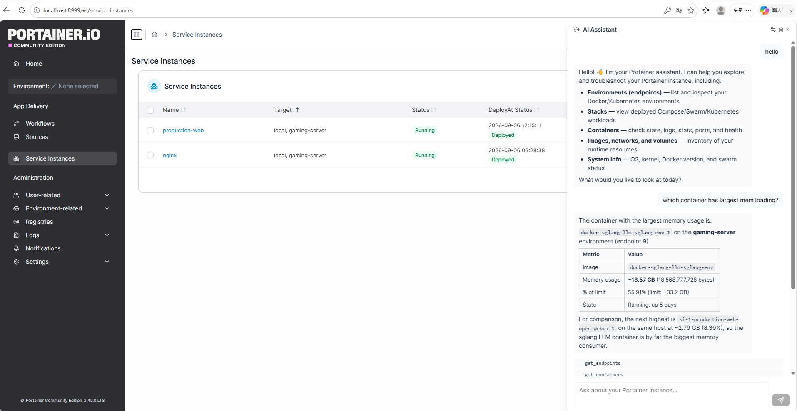
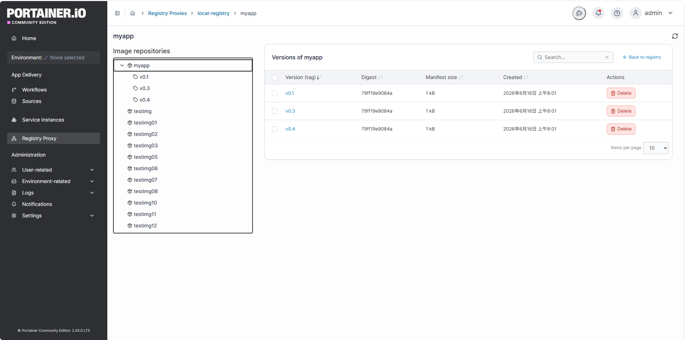

# Portainer CE — ArthurWuTW Fork

This fork of Portainer Community Edition adds three major features on top of upstream Portainer CE:

- **Service Instances** — define a service once and roll it out to many environments in a single operation, with live monitoring, scheduled deployments, and full lifecycle control.
- **Registry Proxy** — expose local Docker registries through Portainer, with `docker login` / `docker pull` / `docker push` support and a browsable image browser.
- **AI Assistant** — an in-UI chat panel backed by any OpenAI-compatible LLM, with read-only tools that let the model inspect your Portainer environments, stacks, and containers.

## Service Instances

A Service Instance is a logical orchestration object that groups a set of target environments (an endpoint group or a list of individual environments) and deploys a shared Compose definition to all of them.

### Features

- **Define a service** — name, description, Compose file, and environment variables.
- **Edit an instance** — change the name, description, targets, or Compose definition at any time from the instance view (Edit button in the header).
- **Multi-target deployment** — target an entire endpoint group or a hand-picked set of environments.
- **Full lifecycle control** — deploy, start, stop, restart, redeploy, and refresh with a single action. Operations run asynchronously and are tracked end to end.
- **Sequential or parallel execution** — manual operations run sequentially with fail-fast semantics (the operation stops at the first failure and remaining targets are marked skipped). Scheduled builds run in parallel across all targets, so a large fleet is ready when the scheduled time arrives.
- **Per-target visibility** — every target reports its own status; the instance shows an aggregated status (running, partial, failed, etc.).
- **Operation history** — a full audit trail of every operation with per-target results and errors, with pagination (`start`/`limit`) for long histories.

### Monitor

- A **Monitor tab** on each instance that shows live per-target status.
- Auto-refreshes target status every 3 seconds, with a toggle to disable auto-refresh.
- **Start / Stop / Restart** buttons to run lifecycle operations directly from the monitor view.

### Deploy & Scheduled Builds

- A **Deploy tab** with a Compose editor to update the service definition and **Deploy now**.
- **Scheduled builds** — schedule a deploy for a future time. Images are pulled on all targets immediately so the deploy is fast and reliable when the time comes.
- **List and cancel** pending scheduled builds, with per-target build status (pending, pulling, image ready, deployed, failed, cancelled).

## Registry Proxy

Registry Proxies let you point Portainer at one or more **local Docker registries** and use them as if Portainer itself were the registry. The classic upstream *Registries* sidebar entry was removed in favor of this.

### Features

- **Docker CLI compatible** — authenticate with your **Portainer username and password** (`docker login <portainer-host>`), then pull and push through the proxy:
  - `docker pull <portainer-host>/registry-proxy/<id>/<image>:<tag>`
  - `docker push <portainer-host>/registry-proxy/<id>/<image>:<tag>` (Portainer admins only)
- **Credential isolation** — Portainer credentials are verified against the Portainer user database and are never forwarded to the upstream registry; the proxy authenticates upstream with the credentials stored on the registry proxy.
- **Image browser UI** — a repository tree with per-repository tag lists (digest, size, created date), breadcrumbs, and per-tag detail views.
- **Tag management** — add a new tag to an existing manifest (retag), and delete images: deleting by tag only untags that tag, deleting by digest removes the manifest (and every tag pointing to it).
- **Role-based access** — any authenticated user can browse and pull; only administrators can push, retag, or delete.
- **TLS support** — optional TLS with an insecure-skip-verify option per proxy.
- **Docker Hub is rejected** as a proxy target — only local registries are allowed.

## AI Assistant

A chat panel (toggle via the bot icon in the page header) that answers questions about your Portainer instance by calling an LLM with a set of **read-only tools**.

- **Bring your own LLM** — configure any OpenAI-compatible endpoint (base URL, API key, model, temperature, max tokens) in the panel settings. The LLM configuration is kept client-side and sent with each request; it is never persisted server-side.
- **Streaming responses** — answers stream back over SSE (`token`, `tool_start`, `tool_end`, `done`, `error` events), with a stop button to cancel in-flight generation.
- **Read-only tools** — the model can inspect, but never modify, your instance:
  - `get_portainer_state` — overall Portainer state
  - `get_endpoints` / `get_endpoint` — environments
  - `get_stacks` / `get_stack` — Compose stacks
  - `get_containers` / `get_container` / `get_container_logs` / `get_container_stats` — containers
  - `get_images`, `get_networks`, `get_volumes`, `get_system_info` — Docker resources
  - `list_registry_proxies`, `get_registry_proxy_images` — registry proxies and their repositories/tags (admin only)
- **Permission-aware** — tool results are scoped to what the authenticated user is allowed to see.
- **Secret redaction** — sensitive environment variables, labels, and URL credentials are replaced with `[REDACTED]` before anything is sent to the LLM.

## How it works (Service Instances)

1. Create a Service Instance with a Compose file and choose its targets.
2. Trigger a lifecycle operation (deploy, start, stop, restart, redeploy, or refresh), or schedule a build for a future time.
3. Portainer resolves the target snapshot, runs the operation (sequentially with fail-fast for manual operations, in parallel for scheduled builds), and persists per-target results as it goes.
4. Watch progress in the UI — the instance status, per-target results, and operation history update in real time.

Service Instances are available in the sidebar under **Service Instances** and are fully exposed through the REST API.

## REST API

All endpoints require authentication (JWT or API key).

### Service Instances

| Method | Path | Description |
|---|---|---|
| GET | `/api/service-instances` | List service instances |
| POST | `/api/service-instances` | Create a service instance |
| GET | `/api/service-instances/{id}` | Inspect a service instance |
| PUT | `/api/service-instances/{id}` | Update a service instance (name, description, targets, Compose) |
| DELETE | `/api/service-instances/{id}` | Delete a service instance |
| POST | `/api/service-instances/{id}/deploy` | Deploy to all targets (async, 202 + operation) |
| POST | `/api/service-instances/{id}/start` | Start on all targets (async) |
| POST | `/api/service-instances/{id}/stop` | Stop on all targets (async) |
| POST | `/api/service-instances/{id}/restart` | Restart on all targets (async) |
| POST | `/api/service-instances/{id}/redeploy` | Redeploy on all targets (async) |
| POST | `/api/service-instances/{id}/refresh` | Recompute aggregated status (sync) |
| POST | `/api/service-instances/{id}/schedule-build` | Schedule a build for a future time |
| GET | `/api/service-instances/{id}/scheduled-builds` | List scheduled builds |
| DELETE | `/api/service-instance-scheduled-builds/{id}` | Cancel a scheduled build |
| GET | `/api/service-instances/{id}/targets` | Resolved targets with per-target status |
| GET | `/api/service-instances/{id}/operations` | Operation history (newest first; supports `start` and `limit` pagination) |
| GET | `/api/service-instance-operations/{id}` | Inspect a single operation |

### Registry Proxies

| Method | Path | Description |
|---|---|---|
| GET | `/api/registry-proxies` | List registry proxies (admin) |
| POST | `/api/registry-proxies` | Create a registry proxy (admin) |
| GET | `/api/registry-proxies/{id}` | Inspect a registry proxy |
| PUT | `/api/registry-proxies/{id}` | Update a registry proxy (admin) |
| DELETE | `/api/registry-proxies/{id}` | Delete a registry proxy (admin) |
| GET | `/api/registry-proxies/{id}/catalog` | List image repositories |
| GET | `/api/registry-proxies/{id}/tags?repository=` | List tags with digest, size and created date |
| POST | `/api/registry-proxies/{id}/tags` | Add a tag to an existing manifest (admin). Body: `{ repository, source, target }` |
| DELETE | `/api/registry-proxies/{id}/manifest?repository=&reference=` | Delete a tag or digest (admin) |
| ANY | `/api/registry-proxies/{id}/v2/...` | Docker registry v2 passthrough |
| ANY | `/v2/registry-proxy/{id}/...` | Docker registry v2 passthrough (docker CLI compatible root mount) |

### AI

| Method | Path | Description |
|---|---|---|
| POST | `/api/ai/chat` | Chat with the AI assistant (SSE stream). Body: `{ messages, llmConfig: { baseUrl, apiKey, model, temperature, maxTokens } }` |

## Statuses

- **Instance status**: unknown, deploying, running, stopped, partial, failed.
- **Operation status**: pending, running, success, partial success, failed, cancelled.
- **Per-target status**: pending, running, success, failed, skipped.
- **Scheduled build status**: pending, pulling, image ready, deployed, failed, cancelled.

## Known limitations (MVP)

- Compose source is the web editor only (no file upload or git repository yet).
- Docker Compose stacks only (Swarm/Kubernetes targets are not supported).
- No automatic rollback; a partial failure requires a manual redeploy.
- Deleting an instance does not undeploy its stacks (they are kept as regular stacks).
- AI Assistant tools are read-only; the model cannot perform mutating operations.
- AI Assistant LLM settings are per-browser (client-side) and not shared across users.
- Registry Proxy only targets local registries (Docker Hub is rejected), and push/retag/delete are admin-only.

## Design docs

- [SERVICE_INSTANCE_DESIGN.md](./SERVICE_INSTANCE_DESIGN.md) — domain model, persistence, service layer, API, and authorization design.
- [ARCHITECTURE_ANALYSIS.md](./ARCHITECTURE_ANALYSIS.md) — how Service Instances integrate with the existing Portainer codebase.
